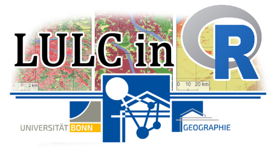

  

# Day 3: Creating and Labeling Validation Samples in R, Accuracy Assessment

---
### Licensing
Code used in this class was adapted from XYZ and are licensed under XYZ license. Any additional material, presentations, figures and GitHub classroom pages created for this class are licensed under [GPL-3.0 License](./LICENSE). 

---

## Today you will... 

  - create and label independent validation samples in R
  - calculate various accuracy metrics to assess the quality of your image classifcation and the performance of your model

## At home you are supposed to...
  - consider your own project and determine a study area.

## Tomorrow you will...
  - independently conduct LULC in R, making full use of the things you learned during the last days.
---

# Problem 1: Validation Sampling
Congratulations on conducting your first LULC in R. By now, we have created a classified image of our study area. But how do we know that we can rely on our classification results? Sure, we tried to assess model performance during model creation but there is no way our preliminary metrics apply to the real classification. We need a profound way to assess the quality of our classication. If you've done your homework, you will already know that we need validation data for that task.

But where does this validation data come from? Well, in theory, we could repeat what we did in QGIS when we collected training samples and use our newly acquired set of samples for validation. An easier way is to randomly sample validation pixels from our raster.  

[And here is how we will do just that.](./03_01_ValidationCreatingSamplesR.pdf)

[Here's a link to the code.](./03_01_ValidationSampling.R)
# Problem 2: Validation Labelling
Great. We now have a bunch of random pixels we can use as validation data. Or rather, that we could use, for they are missing a class label. Like training samples, validation samples require a class label. This class key will be our reference for assessing the accuracy of our classification algorithm. We will let our classification algorithm run over our validation samples and compare the resulting classification with the ground "truth" we acquired by manually assigning each validation pixel a class label. 

Labeling validation data is practically the same you did when labeling training data.

[Nontheless, here is our guide on how to do it.](./03_02_ValidationQGISLabelSamples.pdf) 

You may use these questions to test your understanding:
- How do you proceed, if you cannot decide to which class a certain pixel belongs?

>YOUR ANSWER HERE

- What is the advantage of using e.g. Google Maps images in the labeling process?

>YOUR ANSWER HERE

# Problem 3: Accuracy Assessment
Finally, we are ready to take the very last step of our LULC, the accuracy assessment. A complete accuracy assessment traditionally consists of the following elements:

1) The Accuracy Matrix (also called Confusion Matrix) displays algorithm performance in an easy-to-interpret hit-or-miss fashion.
2) Total accuracy.
3) User's Accuracy, Producer's Accuracy, Commission and Omission Errors.
4) Cohen's Kappa (Kappa-Coefficient) and...
5) ...a test of significance to check whether the other metrics are purely coincidental.

[Here is how we will do that.](./03_03_AccuracyAssessmentR.pdf) 

[Here's a link to the code.](./03_03_AccuracyAssessment.R) 

Answer these questions to test your understanding:
- What is the difference between User's and Producer's accuracy?

>YOUR ANSWER HERE

- What is the difference between your reference and predicted vector?

>YOUR ANSWER HERE

- What does a significance test do?

>YOUR ANSWER HERE

# @Home: Think About Your Own Project
Decide what you want to do before you attempt to work with actual data. You are free to do whatever you want, but here are some ideas to get your minds started:

 - Create a five class LULC of a region of your choice and commpare the results with a a five class unsupervised classification (ISODATA or k-means). K-Means can be done in QGIS (through the OTB toolbox PlugIn, which is a bit icky to install but very powerful), SNAP or Google Earth Engine (don't attempt this if you don't have any GEE experience whatsoever).
 - Create one detailed (many classes) LULC for a region of your choice 
 - Create multiple classifications using few or many training samples (few or many clases...) and compare how the choice of training data (choice of classes) affects your results.
 - Create two classifications of the same region at different times using two satellite images captured at different times. Perform a change detection and find out how the land cover changed between the two dates e.g. surveying deforestation, agricultural expanse, the disappearance of the Aral Sea, ... 
 - Attempt a binary classification using only two classes e.g. to map urban expansion (for this example: urban, non-urban). 
